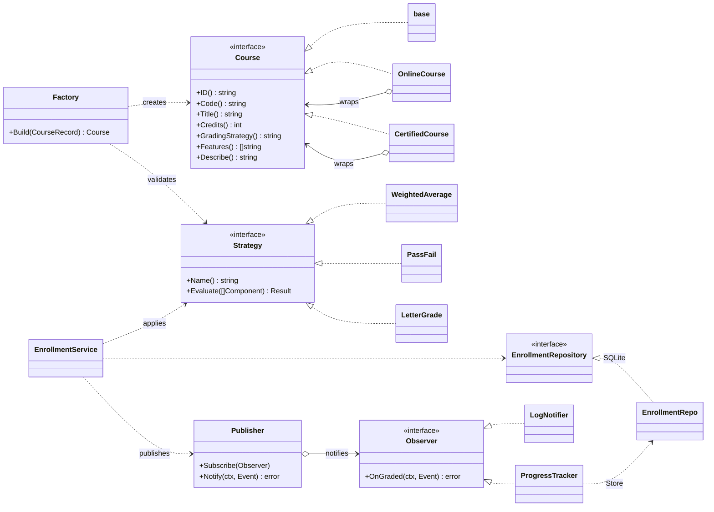
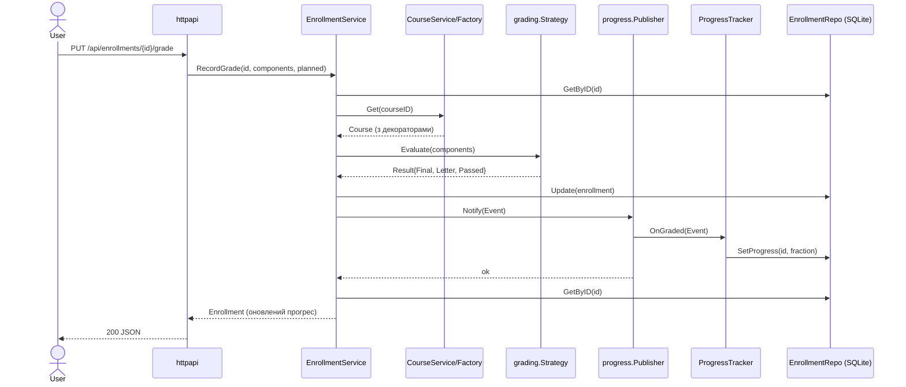

# CourseHub — система керування курсами та студентами

<!-- TODO: замініть OWNER/REPO на ваш GitHub-репозиторій (напр. CMAK12/proj_uni). -->
[](https://github.com/OWNER/REPO/actions/workflows/ci.yml)
[](https://sonarcloud.io/summary/new_code?id=CMAK12_proj_uni)
[](https://sonarcloud.io/summary/new_code?id=CMAK12_proj_uni)
[](https://sonarcloud.io/summary/new_code?id=CMAK12_proj_uni)
[](go.mod)

Навчальний проєкт з предмету **«Аналіз та рефакторинг коду, моделювання та проектування ПЗ»**.

> **Статус якості:** 270+ табличних тестів, локальне покриття **85.6%** (поріг CI — 70%).
> Документація: [архітектура та UML](docs/architecture.md) · [патерни і SOLID](docs/patterns.md) · [AI-контекст](docs/ai-context.md).

Система для освітнього закладу, що реалізує **реєстрацію на курси**, **оцінювання за різними
схемами** та **відстеження прогресу студентів**. Архітектура свідомо побудована навколо патернів
проєктування, які забезпечують **масштабованість** і **розширюваність**.

- **Мова:** Go 1.26
- **Інтерфейс:** REST API (JSON) + серверна Web UI (`html/template`)
- **Сховище:** SQLite (чистий Go-драйвер `modernc.org/sqlite`, без CGO)
- **Залежності:** лише драйвер SQLite; решта — стандартна бібліотека

---

## Швидкий старт

```bash
go test ./...                 # усі юніт-тести
go run ./cmd/server           # старт на http://localhost:8080 (файл coursehub.db)
# ефемерна БД у пам'яті:
go run ./cmd/server -db ":memory:" -addr ":8080"
```

Відкрийте <http://localhost:8080/> — додайте студента, створіть курс, зарахуйте та виставте оцінки.

---

## Архітектура

Шарова архітектура з **інверсією залежностей**: бізнес-логіка (`service`) залежить від **власних
інтерфейсів** репозиторіїв, а конкретні SQLite-реалізації (`storage`) впроваджуються в `main`
(композиційний корінь). Завдяки цьому сховище взаємозамінне, а пакет `domain` не залежить ні від
кого — циклів імпорту немає.

```
cmd/server (DI)  →  httpapi  →  service  →  ┌ ports (інтерфейси Repository)
                                            ├ grading  (Strategy)
                                            ├ progress (Observer)
                                            └ course   (Factory + Decorator)
                                   ▲
                        storage (SQLite) ──┘  реалізує інтерфейси Repository
        усі шари залежать від domain (сутності, sentinel-помилки)
```

### Діаграма класів (UML)



### Діаграма послідовності (UML) — виставлення оцінки



---

## Патерни проєктування

| Патерн | Де реалізовано | Призначення / навіщо |
|--------|----------------|----------------------|
| **Repository** | `internal/service/ports.go` (інтерфейси), `internal/storage/*` (SQLite) | Абстрагує доступ до даних. Сервіси не знають про SQLite → сховище можна замінити, не змінюючи бізнес-логіку. **Розширюваність.** |
| **Strategy** | `internal/grading/` (`weighted.go`, `passfail.go`, `letter.go`) | Взаємозамінні алгоритми оцінювання. Нову схему додають окремим типом, без змін у сервісах. **Розширюваність.** |
| **Observer** | `internal/progress/` (`observer.go`, `tracker.go`, `notifier.go`) | Реакція на подію оцінювання: `ProgressTracker` рахує прогрес, `LogNotifier` сповіщає. Нові реакції (email, аналітика) — нові спостерігачі. **Масштабованість поведінки.** |
| **Factory** | `internal/course/factory.go` | Єдине місце складання курсу: підбір стратегії + навертання декораторів. Інкапсулює конструювання, узгоджує об'єкт у пам'яті з записом у БД. |
| **Decorator** | `internal/course/decorator.go` (`OnlineCourse`, `CertifiedCourse`) | Динамічне розширення курсу новою поведінкою без зміни базового класу. Декоратори комбінуються. **Розширюваність.** |

---

## REST API

| Метод і шлях | Опис |
|--------------|------|
| `POST /api/students` | Створити студента `{name, email}` |
| `GET /api/students` | Список студентів |
| `GET /api/students/{id}` | Студент за ID |
| `GET /api/students/{id}/progress` | Прогрес студента по всіх курсах |
| `POST /api/courses` | Створити курс `{code, title, credits, type, grading, features, platform}` |
| `GET /api/courses` | Список курсів |
| `POST /api/enrollments` | Зарахувати `{studentId, courseId}` |
| `PUT /api/enrollments/{id}/grade` | Виставити оцінку `{components:[{name,score,maxScore,weight}], planned}` |

Коди помилок: `400` (валідація), `404` (не знайдено), `409` (дублікат / повторне зарахування).

### Приклад

```bash
curl -X POST localhost:8080/api/students \
  -d '{"name":"Іван","email":"ivan@lnu.ua"}'

curl -X POST localhost:8080/api/courses \
  -d '{"code":"CS101","title":"Алгоритми","credits":5,"type":"online","grading":"weighted","features":["certified"],"platform":"Moodle"}'

curl -X POST localhost:8080/api/enrollments \
  -d '{"studentId":"<SID>","courseId":"<CID>"}'

# Виставлення 1 з 2 запланованих компонентів → прогрес 50%
curl -X PUT localhost:8080/api/enrollments/<EID>/grade \
  -d '{"components":[{"name":"exam","score":90,"maxScore":100,"weight":0.6}],"planned":2}'

curl localhost:8080/api/students/<SID>/progress
```

---

## Схеми оцінювання (Strategy)

- **`weighted`** — зважене середнє за вагами компонентів (за відсутності ваг — звичайне середнє); поріг 60.
- **`passfail`** — середнє проти порогу; результат `P`/`F`.
- **`letter`** — буквена оцінка `A–F` за відсотком.

## Структура проєкту

```
cmd/server/main.go          композиційний корінь (DI), graceful shutdown
internal/domain/            сутності + sentinel-помилки (Course — інтерфейс)
internal/grading/           Strategy: схеми оцінювання
internal/course/            Factory + Decorator
internal/progress/          Observer: Publisher, ProgressTracker, LogNotifier
internal/service/           бізнес-логіка + інтерфейси Repository (ports.go)
internal/storage/           Repository: реалізація на SQLite
internal/httpapi/           REST + Web UI (html/template)
```

## Тестування

Table-driven юніт-тести (стандартна бібліотека `testing`):

```bash
go test ./...
go vet ./...
```

- `grading` — кожна стратегія, межові бали, округлення, реєстр стратегій;
- `course` — Factory будує правильні стратегію/декоратори, `Describe()`/`Features()`, стекування декораторів;
- `progress` — нотифікація всіх спостерігачів, перерахунок прогресу, об'єднання помилок, логер;
- `service` — реєстрація, відмова від дублювання, застосування Strategy + оновлення прогресу через Observer, шляхи помилок (з fake-репозиторієм, без БД);
- `storage` — CRUD проти `:memory:` SQLite, списки/сортування, мапінг унікальних обмежень на доменні помилки;
- `httpapi` — інтеграційні тести всіх ендпоінтів (статуси `200/201/303/400/404/409`), web-сторінки, шаблонні функції;
- `cmd/server` — `run()` з graceful shutdown через скасування контексту та шлях помилки відкриття БД.

### Покриття локально

```bash
go test ./... -covermode=atomic -coverprofile=coverage.out
go tool cover -func=coverage.out | tail -1   # сумарне покриття
go tool cover -html=coverage.out -o coverage.html
```

Поточний результат: **85.6%** сумарного покриття, **270+** тест-кейсів.

---

## CI/CD та SonarQube

Пайплайн [`.github/workflows/ci.yml`](.github/workflows/ci.yml) має дві задачі:

1. **lint** — `golangci-lint` (errcheck, govet, staticcheck, revive, gocritic тощо за [`.golangci.yml`](.golangci.yml)).
2. **test** — `go vet`, запуск тестів через `gotestsum`, генерація звітів, **gate покриття ≥ 70%**, вивантаження артефактів і скан SonarCloud.

### Артефакти збірки

Крок генерує та зберігає (як build artifacts, 30 днів) звіти:

| Файл | Формат | Призначення |
| --- | --- | --- |
| `coverage.html` | HTML | Візуальний звіт покриття по рядках |
| `cobertura.xml` | XML | Покриття у форматі Cobertura |
| `junit.xml` | XML | Результати тестів (JUnit) |
| `report.json` | JSON | `go test -json` для SonarCloud |
| `coverage.out` / `coverage.txt` | text | Профіль покриття Go |

### Підключення SonarCloud (Quality Gate)

1. Створіть проєкт на <https://sonarcloud.io> (увійдіть через GitHub).
2. У `sonar-project.properties` замініть `sonar.projectKey` та `sonar.organization`
   на свої значення.
3. У GitHub: **Settings → Secrets and variables → Actions** додайте секрет
   `SONAR_TOKEN` (токен зі SonarCloud). Якщо секрет відсутній, крок Sonar
   пропускається, решта пайплайну працює.
4. У бейджах вгорі README замініть `OWNER/REPO` і `PROJECT_KEY`.

Quality Gate перевіряє покриття, дублювання, надійність і супровідність;
звіт покриття передається через `sonar.go.coverage.reportPaths=coverage.out`.
