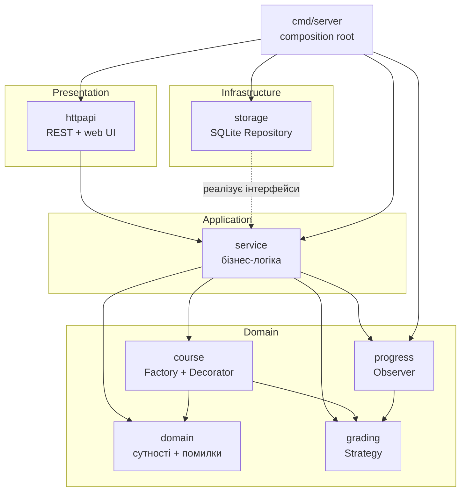
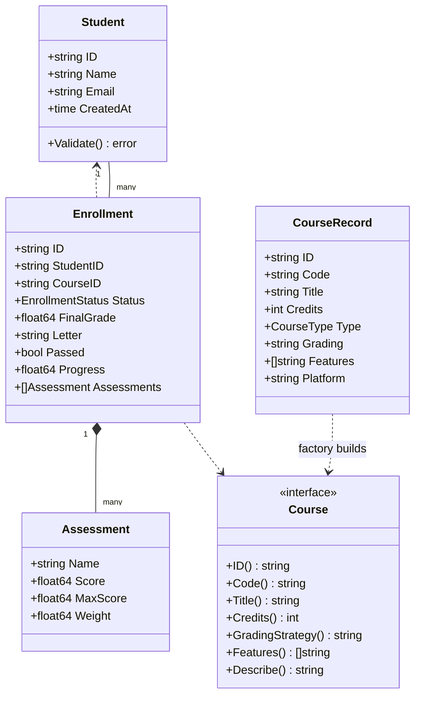
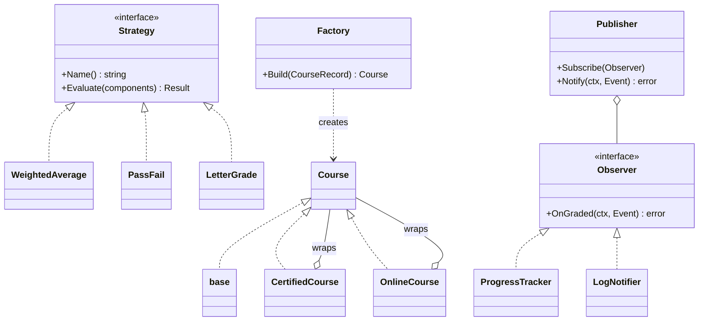
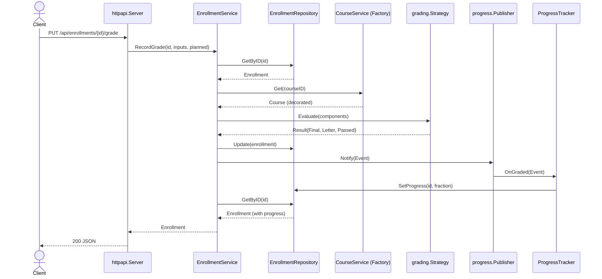
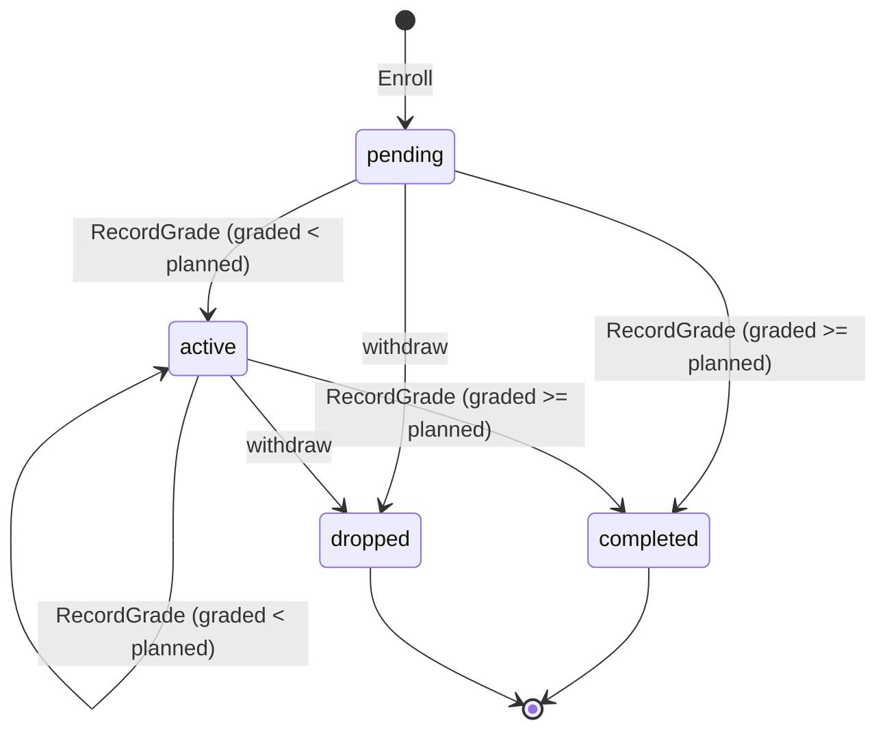

# Архітектура та UML

CourseHub — система керування курсами освітнього закладу: реєстрація студентів,
каталог курсів, зарахування та оцінювання з відстеженням прогресу. Код
структуровано за принципом чистої багатошарової архітектури з інверсією
залежностей (залежності спрямовані всередину, до `domain`).

## Шари

Ключова ідея: `service` залежить лише від **інтерфейсів** репозиторіїв, які він
сам і оголошує (`StudentRepository`, `CourseRepository`,
`EnrollmentRepository`). Конкретні SQLite-реалізації з пакета `storage`
впроваджуються у `cmd/server` (Dependency Injection). Це дозволяє підмінити
сховище без зміни бізнес-логіки.

## Доменна модель (class diagram)

## Патерни GoF (class diagram)

## Сценарій «Записати оцінку» (sequence diagram)

Тут зустрічаються всі патерни: Strategy обчислює результат, Observer публікує
подію, ProgressTracker персистить прогрес.

## Стани зарахування (state diagram)

